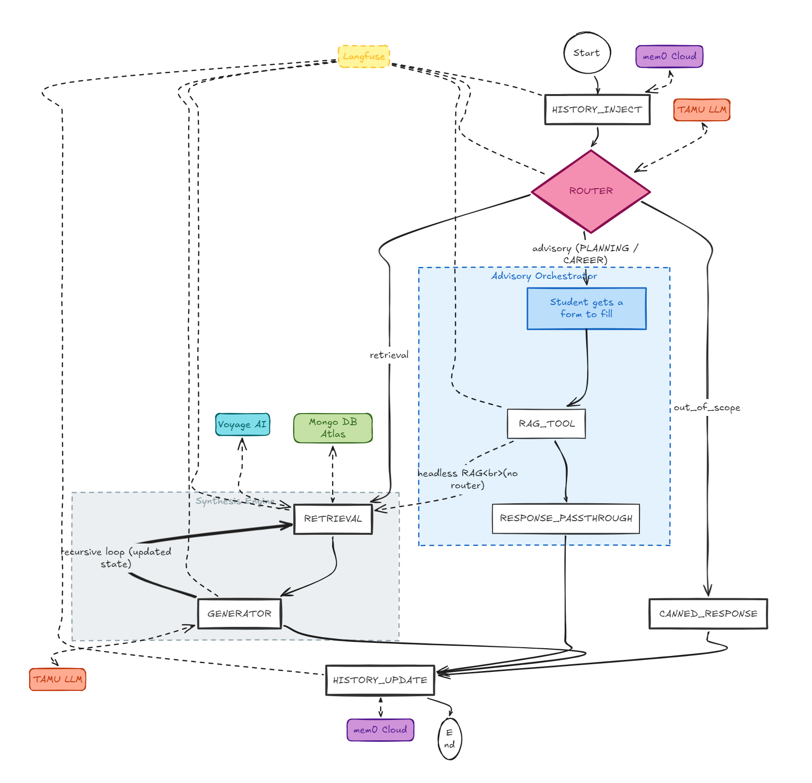

# TamuBot

A RAG-based academic assistant for Texas A&M University students. Ask questions about courses, syllabi, grading policies, schedules, and university policies — get cited answers grounded in real syllabus data.

## Architecture

TamuBot follows a **3-stage RAG pipeline** orchestrated by LangGraph:

- **Router** — Gemini 2.5 Flash extracts structured variables (course IDs, categories, intent type) from the user query. A pure-Python function matrix derives the retrieval strategy — no ML classification step.
- **Retrieval** — Three search paths depending on query type: metadata lookup (exact index), hybrid search (RRF: vector + BM25), or semantic search (full-corpus vector). Results are reranked by Voyage AI cross-encoder.
- **Generator** — Gemini 2.5 Flash produces a cited answer using function-adaptive prompts and XML-formatted context. Every claim links back to a `[Source N]` citation.
- **Agentic Advisory** — Personalization layer that reads the student's completed-coursework profile (entered through a form in the UI) and overlays it onto retrieval and generation, so the system never recommends a course the student has already taken and can suggest natural follow-ups.

The pipeline runs as a LangGraph state machine with conversation memory (mem0 Cloud), session caching, and SQLite checkpointing.

## Tech Stack

### Frontend

- **Streamlit** — Chat UI with session state management

### Backend / RAG Pipeline

- **LangGraph** — State machine orchestration with conditional routing
- **Gemini 2.5 Flash** — Router, generator, and PDF parsing
- **Gemini 2.5 Flash Lite** — Validation model
- **MongoDB Atlas** — Vector store, full-text search, and metadata indexes
- **Voyage AI** — `voyage-3` embeddings (1024-dim) and `rerank-2` cross-encoder
- **mem0 Cloud** — Conversational memory across sessions
- **Pydantic v2** — Schema validation for all data models

### Data Pipeline

- **Scrapy** — Course catalog and class schedule spiders
- **Playwright** — Simple Syllabus PDF downloader (bypasses CloudFront WAF)
- **Docling + Gemini 2.5 Flash** — Multimodal PDF → structured JSON parsing (13 categories)
- **Semantic Chunking** — Token-aware chunker that respects section/category boundaries instead of fixed-width splits, so a chunk represents one coherent topic (grading policy, schedule, learning outcomes, ...)
- **Knowledge Graph** — Course/section/instructor/topic relationships modeled as a graph alongside the vector store; used both for retrieval-time expansion (e.g. "what else does this instructor teach?") and for evaluation set synthesis

### Observability & Evaluation

- **Langfuse** — End-to-end request tracing (Router → Retrieval → Generator)
- **RAGAS** — Async background evaluation plus offline golden-set benchmarks (Faithfulness, Answer Relevancy, Context Precision, Context Recall)
- **OpenTelemetry** — Instrumentation layer

### Infrastructure

- **Docker** — Containerized development environment (Python 3.14-slim)
- **Docker Compose** — App + API rate-limiting proxy
- **API Proxy** — Per-session rate budgets for TAMU API and Voyage AI

### Development

- **pytest** — Unit and integration tests
- **mypy** — Static type checking
- **ruff** — Linting and formatting

## Features

- **Intelligent Query Routing** — 8-function derivation matrix handles metadata lookups, hybrid search, semantic discovery, multi-course comparisons, and out-of-scope rejection
- **Agentic Advisory** — A form in the UI captures the courses the student has already completed; the agent reads that profile before recommending anything, filters out already-taken courses, and tailors next-step suggestions
- **Multi-Course Comparison** — Structured side-by-side tables with per-cell citations
- **Recursive Course Discovery** — 5-step pipeline finds related courses anchored to a named course (e.g., "What should I take alongside CSCE 638?")
- **Intent-Aware Generation** — Advisory overlays for academic, career, difficulty, and planning queries
- **Semantic Chunking** — Syllabi are split along section boundaries so retrieval surfaces one coherent topic at a time instead of mid-paragraph fragments
- **Knowledge Graph** — Course / instructor / topic relationships modeled as a graph and used both for retrieval expansion and for synthesizing evaluation questions
- **Data Integrity Flags** — Disclaimers when syllabus data is missing for requested courses/categories
- **Conversational Memory** — mem0 Cloud preserves context across sessions
- **Full Observability** — Every query traced end-to-end in Langfuse with automated RAGAS scoring
- **Citation System** — All answers include `[Source N]` references to specific syllabus chunks

## Data Pipeline

Knowledge is prepared offline in four stages — **scrape → parse → embed → store** — so that query time only ever touches the indexes:

- **Scrape** — Scrapy spiders collect the course catalog and class sections; a Playwright downloader retrieves graduate syllabus PDFs from Simple Syllabus.
- **Parse** — Docling and Gemini 2.5 Flash turn each PDF into structured JSON across the 13 syllabus categories.
- **Chunk & embed** — A token-aware semantic chunker splits each syllabus along its section boundaries so a chunk is one coherent topic, and Voyage AI embeds the chunks.
- **Store** — Validated records are upserted into MongoDB Atlas alongside the vector, full-text, and metadata indexes and the course/instructor/topic knowledge graph.

### Preprocessing quality (v6b)

The ingestion track that prepares syllabus chunks is treated as its own quality
surface. Each PDF flows through staged transforms — layout-aware parsing, optional
vision enrichment of tables/figures, semantic chunking, and a tagging pass that
detects shared university **boilerplate** (legal/admin text repeated across
departments) and **near-duplicate** chunks (within and across syllabi) so the
retriever isn't flooded with the same policy paragraph from every course. Every
stage carries data-quality checks, and a separate model-graded **judge** scores
the output on four dimensions — boilerplate, dedup, chunking, and fidelity —
against a frozen error taxonomy, so changes to the algorithms can be compared
without silently regressing content faithfulness.

## Evaluation

TamuBot is evaluated against two purpose-built **RAGAS golden sets** generated from the knowledge graph:

- A **course-coverage** set — factual questions grounded in specific syllabus sections (grading, schedule, learning outcomes, instructors)
- A **course-discovery** set — open-ended "which course teaches X?" / "what should I take if I'm interested in Y?" questions

Each pipeline configuration is scored on **Faithfulness**, **Answer Relevancy**, **Context Precision**, and **Context Recall**, and the runner also records **end-to-end latency** and **per-query LLM cost**. That lets configuration changes (chunking strategy, retriever weights, rerank depth, model swap) be compared on quality *and* cost/latency in the same report.

## License

MIT
