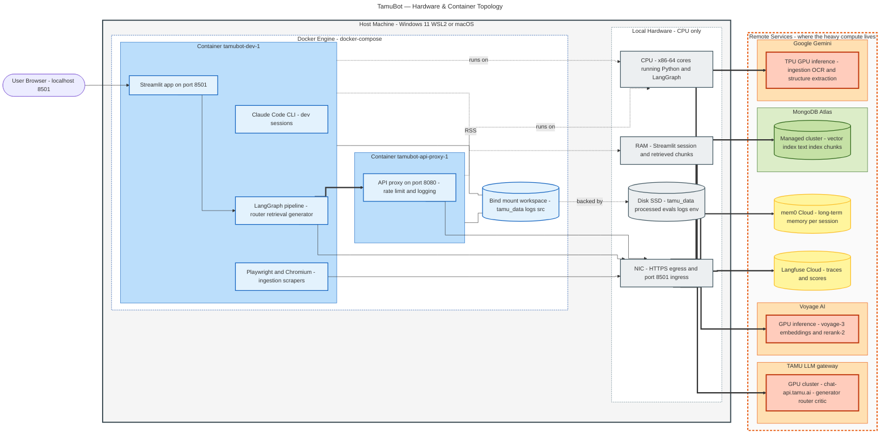
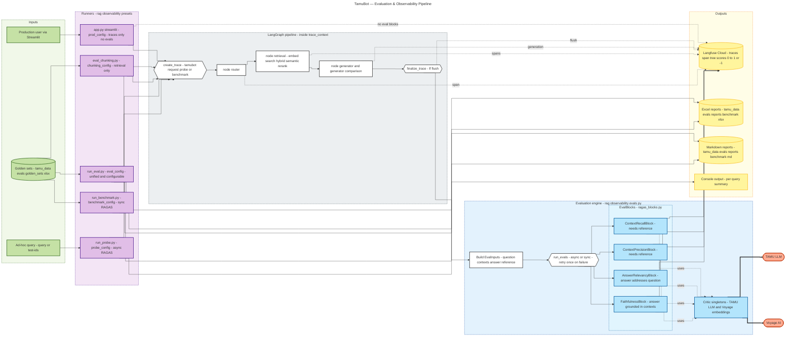

## TamuBot — Infrastructure & Evaluation Diagrams

Companion to `docs/MAIN_DRAWING.md`. Plain-label flavor — designed to paste cleanly into Excalidraw's mermaid importer (no ` ` tags, minimal styling).

1. **Hardware & Container topology** — from the user's browser down to the silicon, splitting *local* CPU/disk/network from *remote* GPU/storage.
2. **Evaluation & Observability pipeline** — how `run_probe`, `run_benchmark`, `eval_chunking`, and `run_eval` wrap the same LangGraph pipeline with tracing + RAGAS scoring.

---

## 1. Hardware & Container Topology

Local box is CPU-only — Python orchestration, disk I/O, and network egress. All AI compute runs on remote provider GPUs over HTTPS. The api-proxy container is the only path out to TAMU + Voyage so we can rate-limit and log.

**Reading guide.**
- **Bold arrows (`==>`)** are the hot path of a user query: Streamlit → pipeline → proxy → TAMU/Voyage GPUs, plus a direct hop to Atlas.
- **Local hardware** does *zero* model inference. CPU runs Python state + LangGraph, RAM holds the session, the SSD holds processed syllabi + golden sets + logs, the NIC pushes every model call out.
- **Remote hardware** is where the GPUs live: TAMU hosts the generator/router/critic, Voyage hosts embeddings + reranker, Gemini handles ingestion OCR, Atlas serves the indexes.

---

## 2. Evaluation & Observability Pipeline

Same LangGraph pipeline reused by four runners. Each runner picks a preset `ObservabilityConfig` that decides trace name, tags, and which `EvalBlock`s fire after the pipeline returns. RAGAS blocks call TAMU (critic LLM) and Voyage (critic embeddings), then post scores back to Langfuse alongside the original trace.

**Reading guide.**
- **Runners are interchangeable wrappers.** They all build the same trace and run the same LangGraph; the only differences are the preset `ObservabilityConfig` (trace name, tags, which `eval_blocks` fire, async vs sync, generator on/off).
- **Tracing is live.** Spans (`node.router`, `node.retrieval.*`, `node.generator`) stream to Langfuse during pipeline execution; `finalize_trace` flushes on completion.
- **Eval blocks run *after* the pipeline returns.** `EvalInputs` is assembled from final state, then `run_evals` dispatches the registered RAGAS blocks. Failures get a `-1` score with metadata so the trace is never silently dropped.
- **Critic LLM / embeddings are reused singletons** — TAMU gateway for reasoning, Voyage for embedding-based metrics. They make their own HTTPS calls during scoring, separate from the pipeline call.
- **Production (`prod_config` in app.py) ships traces only — no eval blocks fire on user queries.** RAGAS scoring is reserved for probe/benchmark/chunking/eval runs.
